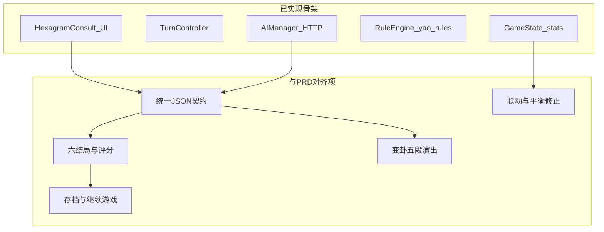

# 基于《项目文档》的后续开发任务规划

## 现状与文档差距（简要）

- **已有**：[game/scenes/HexagramConsult.gd](d:/AI互动叙事游戏/game/scenes/HexagramConsult.gd) 中「选行动 → AI/兜底 → 叙事 → 数值 → 变卦 → 结局检测 → 下一回合」骨架；[game/autoloads/AIManager.gd](d:/AI互动叙事游戏/game/autoloads/AIManager.gd) 含超时与兜底；[game/systems/RuleEngine.gd](d:/AI互动叙事游戏/game/systems/RuleEngine.gd) 用 `yao_rules` 驱动变卦；[game/hexagrams.json](d:/AI互动叙事游戏/game/hexagrams.json) 已扩充。
- **主要偏差**：PRD 第 6、7 节规定的 **JSON 字段名与语义**（`narrative` / `yao_changed` / `delta_stats` / `philosophy`）与当前代码使用的 `Narrative` / `Next_Yao_Index` / `State_Changes` 不一致；系统提示词、模型与 `max_tokens` 与 PRD 6.1、6.2 不一致；[game/autoloads/GameState.gd](d:/AI互动叙事游戏/game/autoloads/GameState.gd) 初始三才为 50/50/50，文档 FR-01 要求 **60/55/50**；[game/systems/EndingRouter.gd](d:/AI互动叙事游戏/game/systems/EndingRouter.gd) 仅覆盖部分即时败局与「满回合即胜」，**未实现** 文档第 10 节的 6 种结局与评分。

---

## 阶段 A — P0：契约统一与核心规则（应最先做）

统一 **API / 兜底 / 解析** 三层使用同一套字段，避免场景脚本与 JSON 各写一套键名。

| 任务 | 说明 | 主要涉及文件 |
|------|------|----------------|
| **A1. 定义响应 DTO 与解析器** | 按 PRD FR-08 校验：`narrative`、`yao_changed`(1~6)、`delta_stats`（strength/morale/treasury，范围 clamp -20~+20）、`philosophy`；解析失败走兜底并按 6.3 随机 `yao_changed`。 | 新建如 `game/systems/AIResponseParser.gd` 或并入 `AIManager`；[HexagramConsult.gd](d:/AI互动叙事游戏/game/scenes/HexagramConsult.gd) 只消费规范化后的字典 |
| **A2. 对齐系统提示与用户 Payload** | 将 PRD 6.1 全文迁入常量；`build_payload` 按 6.2 注入卦名、卦性、三才、战略范畴+具体行动、近两回合摘要；模型与 `max_tokens` 按文档调整（与密钥/费用策略一致即可）。 | [AIManager.gd](d:/AI互动叙事游戏/game/autoloads/AIManager.gd) |
| **A3. 兜底数据结构升级** | [fallback_narratives.json](d:/AI互动叙事游戏/game/resources/fallback_narratives.json) 与 PRD 6.4 对齐（至少先支持按 `hexagram_id` + `category` 选取；MVP 可先 **16 卦 × 4 范畴** 再扩全量）。 | `fallback_narratives.json`、`_use_fallback` 选取逻辑 |
| **A4. 开局与数值基准** | FR-01：初始三才 **60/55/50**；起卦排除文档列出的极端凶卦；开场叙事（可先静态模板 + 占位，再接 AI）。 | [GameState.gd](d:/AI互动叙事游戏/game/autoloads/GameState.gd)、主菜单/首场景进入逻辑 |
| **A5. 战略选择完整流程** | FR-03/FR-04：四范畴 → 每类 4~5 个具体选项 → 确认；[ActionPanel.gd](d:/AI互动叙事游戏/game/ui/ActionPanel.gd) 需能传出 `category` + `action_name`（或等价 id）供 Payload 与兜底加权。 | `ActionPanel.gd`、`HexagramConsult.gd` |
| **A6. 错误与失败信号** | 连接 `consult_failed` / `fallback_activated`：统一走与成功相同的「叙事 → 变卦 → 结算」路径，并写日志（PRD 5.3/6.3）。 | `HexagramConsult.gd`、`AIManager.gd` |
| **A7. 数值联动与保护** | FR-06、9.3：民心&lt;30 资财额外扣、资财&lt;30 国力扣；连续同爻修正、国力危机时的 delta 保护（文档阈值与实现保持一致）。 | 新建或在 `GameState`/回合结算处集中处理 |

---

## 阶段 B — P0/P1：完整回合体验与 FR-05 演出

| 任务 | 说明 | 主要涉及 |
|------|------|----------|
| **B1. 变卦五段序列** | FR-05：六爻高亮 → 变爻闪烁+音效 → 新卦翻入 → 背景淡入 → BGM 过渡（可与现有 HexagramDisplay 动效合并）；**快速模式**（总时长 50%）依赖设置中的枚举。 | [HexagramDisplay.gd](d:/AI互动叙事游戏/game/ui/HexagramDisplay.gd) 或新建协调器节点 |
| **B2. HUD 与危机表现** | FR-02/8.3：回合数、三才条、危机闪红、AI 等待全屏蒙层「国师沉思中…」。 | `StatsHUD`、`HexagramConsult` |
| **B3. 布局向 PRD 8.1 靠拢** | 在 1920×1080 基准下分区（卦象区 / 叙事区 / 战略区 / HUD）；可先功能对齐再像素级还原。 | `HexagramConsult.gd` 布局代码 |

---

## 阶段 C — P1：六结局、评分、存档与设置

| 任务 | 说明 | 主要涉及 |
|------|------|----------|
| **C1. 结局系统重写** | 按 PRD 第 10 节实现 **6 种结局** 的触发顺序（即时败局 &gt; 条件败局 &gt; 第 25 回合两种终局）；扩展 [EndingRouter.gd](d:/AI互动叙事游戏/game/systems/EndingRouter.gd) 与 [Ending.gd](d:/AI互动叙事游戏/game/scenes/Ending.gd) 展示不同文案/图。 | `EndingRouter`、`Ending` 场景 |
| **C2. 评分系统** | 第 10.2 节公式与 S~D 评级；结局画面展示分数。 | 可与 `Ending` 或 `GameState` 快照配合 |
| **C3. 存档（FR-09）** | `user://save/autosave.json` + 单手动槽；含回合、卦、三才、历史叙事（最多 10 条）、flags；损坏时友好提示。 | 新建 `SaveManager` 或 autoload；`MainMenu` 增加「继续游戏」 |
| **C4. 设置（FR-10）** | 在现有 API Key 基础上补齐：动画速度、文字速度、BGM/SFX、全屏；读写 `user://settings.cfg`。 | [Settings.gd](d:/AI互动叙事游戏/game/scenes/Settings.gd)、各 UI 消费配置 |

---

## 阶段 D — P1 / M3：教程、内容资产与发布准备

| 任务 | 说明 |
|------|------|
| **D1. 情境式教程（FR-11）** | 前 3 回合气泡，可关且本局不再显示；需 `flags.tutorial_completed` 入存档。 |
| **D2. 兜底库扩容** | 按 6.4 从 16 卦逐步扩到 64 卦；可与美术并行。 |
| **D3. 美术与音频** | PRD 8.2：每卦背景、BGM 映射、`hexagrams.json` 中 `background_image` / `bgm_track` 与资源管线一致。 |
| **D4. 模块通信规范** | PRD 12.2：核心跨模块用 **Signal** 解耦（逐步收敛直接跨节点引用）。 |
| **D5. 测试与指标** | 对照第 2、5 节：AI 成功率/耗时、Session 稳定性、无 Key 完整一局。 |

---

## 建议执行顺序（摘要）

1. **A1–A3 + A6**：统一 JSON 契约与解析，否则后续结局、存档、统计都会重复返工。  
2. **A4–A5 + A7**：开局、完整战略流、数值规则与文档一致。  
3. **B1–B3**：核心「爽点」演出与可读 HUD。  
4. **C1–C4**：可玩 MVP 的「能打完一局并有结果」闭环。  
5. **D1–D5**：体验、内容与上架前硬ening。

文档要求每次迭代更新 [项目文档.md](d:/AI互动叙事游戏/项目文档.md) 第 14 节开发日志与版本末位号；实施阶段可在完成 A+B 或 C 后各记一条。
