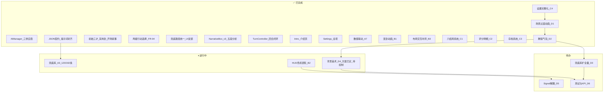

# 基于《项目文档》的后续开发任务规划（v1.2.9 更新）

## 当前实现状态

### 已完成功能

| 模块                                                                                            | 状态      | 主要文件                               |
| ----------------------------------------------------------------------------------------------- | --------- | -------------------------------------- |
| 多供应商 AI（DeepSeek/Gemini/Claude）、30s 超时、三 Key 存储                                    | ✅         | `AIManager.gd`                         |
| JSON 契约全字段对齐（narrative/yao_changed/delta_stats/philosophy/analysis/next_hexagram_hint） | ✅         | `AIResponseParser.gd`                  |
| System Prompt 完整对齐（【输入格式】节、analysis 五段规格、next_hexagram_hint 规则 9）          | ✅         | `AIManager.gd`                         |
| 初始三才 60/55/50、禁用卦 [29, 47]、首回合感知起卦的静态开场叙事                                | ✅         | `GameState.gd`、`HexagramConsult.gd`   |
| 两级战略选择（范畴→行动）、FR-04 完整选项表、strategy_chosen 信号                               | ✅         | `ActionPanel.gd`                       |
| 兜底叙事路径统一（所有失败情形经 consult_completed 走完整结算）、fallback UI 反馈               | ✅         | `AIManager.gd`、`HexagramConsult.gd`   |
| NarrativeBox v3：打字机 + 五段分析延迟显示、五色标头                                            | ✅         | `NarrativeBox.gd`                      |
| 回合闭环（TurnController 状态机、EndingRouter 基础即时败局）                                    | ✅         | `TurnController.gd`、`EndingRouter.gd` |
| 64 卦完整数据（name_zh/nature/yao_rules/yao_lines）                                             | ✅         | `hexagrams.json`                       |
| 介绍页（Intro.tscn，六节内容，路由新游戏→Intro→游戏）                                           | ✅         | `Intro.gd`                             |
| 兜底叙事库（卦 1–10，120 条，含完整 analysis）                                                  | ⏸ 120/192 | `fallback_narratives.json`             |
| 变卦动画（变爻红闪 0.6s + 新卦翻入 1.2s，快速模式 ×0.5）                                       | ✅         | `HexagramDisplay.gd`                   |
| 布局重构 B3（顶部栏/三列/卦爻解析面板/三阶段交互/【提示】/手动存档）                           | ✅         | `HexagramConsult.gd`、`ActionPanel.gd` |
| 六结局系统（7 种结局触发优先级 + 富文本结局画面 + 胜负视觉区分）                               | ✅         | `EndingRouter.gd`、`Ending.gd`         |
| 评分明细（分项存储 + GridContainer 明细面板 + S/A/B/C/D 评级上色）                             | ✅         | `ScoreCalculator.gd`、`Ending.gd`      |
| 存档系统（autosave/manual 读写 + 损坏对话框 + 游戏内手动存档 Toast）                           | ✅         | `SaveManager.gd`、`MainMenu.gd`        |
| 设置完整化（AudioServer 总线接入 + 音量数值标签；全部 9 项读写 cfg）                           | ✅         | `AppSettings.gd`、`Settings.gd`        |

### 待解决偏差

| 编号    | 偏差项                                                                                                          | 涉及 PRD    | 对应任务       |
| ------- | --------------------------------------------------------------------------------------------------------------- | ----------- | -------------- |
| **P3**  | 兜底叙事卦 11–16 未填充（120/192 条，62.5%）；MVP 目标 192 条                                                   | 6.4 / I-02  | **A3**（续写） |
| **P7**  | 数值联动规则缺失：民心<30→资财-3/回合、资财<30→国力-2/回合、危机 delta×1.5、连续同爻强制换爻、国力<25 降幅限 10 | FR-06 / 9.3 | **A7**         |
| ~~**P8**~~  | ~~EndingRouter 仅覆盖部分即时败局，缺条件败局、25 回合终局、评分公式~~ → ✅ C1/C2 已完成            | 第 10 节    | ~~**C1–C2**~~  |
| ~~**P9**~~  | ~~变卦动画未实现 FR-05 五段序列~~ → ✅ B1 已完成（移除六爻逐行高亮，保留变爻红闪+新卦翻入）          | 4.2         | ~~**B1**~~     |
| ~~**P10**~~ | ~~Intro 页面无场景过渡动画（I-03）~~ → ✅ D1 已完成（SceneTransition Autoload，淡入淡出） | FR-11       | ~~**D1**~~     |
| ~~**P11**~~ | ~~存档系统（FR-09）未实现，主菜单"继续游戏"无实际存档读取~~ → ✅ C3 已完成                           | 4.4         | ~~**C3**~~     |

---

## 阶段 A — P0：契约统一与核心规则

| 任务                                    | 说明                                                                                                                                                                                                                                                                          | 状态      | 主要涉及文件                                                     |
| --------------------------------------- | ----------------------------------------------------------------------------------------------------------------------------------------------------------------------------------------------------------------------------------------------------------------------------- | --------- | ---------------------------------------------------------------- |
| ~~**A1. 响应 DTO 对齐**~~               | normalize() 覆盖全部 6 字段，含别名兼容、clamp、越界随机爻；移除 HexagramConsult 冗余二次 normalize。                                                                                                                                                                         | ✅ 已完成  | `AIResponseParser.gd`、`HexagramConsult.gd`                      |
| ~~**A2. 系统提示词对齐**~~              | 补充【输入格式】节；analysis 改为每段 200~350 字共五段；新增 next_hexagram_hint 规则 9；user message 改中文范畴名+`- `前缀。                                                                                                                                                  | ✅ 已完成  | `AIManager.gd`                                                   |
| ⏸ **A3. 兜底库扩容**                    | 卦 1–10 完成（120 条）。**待续**：卦 11–16（泰/否/同人/大有/谦/豫），参考 batch2_fallback.py 模式，写入 batch3_fallback.py，完成后达 192 条 MVP 目标。                                                                                                                        | ⏸ 120/192 | `fallback_narratives.json`、`tools/batch3_fallback.py`（待创建） |
| ~~**A4. 开局数值基准**~~                | 初始三才 60/55/50 与禁用卦 [29,47] 已在代码中；首回合 HexagramConsult._ready() 注入感知起卦的静态开场文本。                                                                                                                                                                   | ✅ 已完成  | `GameState.gd`、`HexagramConsult.gd`                             |
| ~~**A5. 战略选择流程**~~                | ActionPanel 已实现两级选择 + 返回按钮 + FR-04 完整选项表 + strategy_chosen 信号传出 {category, action_name}。                                                                                                                                                                 | ✅ 已完成  | `ActionPanel.gd`                                                 |
| ~~**A6. 失败信号路径**~~                | _finish_with_fallback() 在所有失败情形下经 consult_completed 走完整结算路径；新增 fallback_activated UI 反馈（蒙层文案切换）。                                                                                                                                                | ✅ 已完成  | `HexagramConsult.gd`、`AIManager.gd`                             |
| ~~**A7. 数值联动与保护**~~ ✅ **已完成** | 五条规则均已在 `GameState.gd` 中实现：①② `_apply_passive_linkage()`；③ `_scale_deltas_crisis()`；④ `_enforce_yao_variety()`（history 最后 3 条 + 当前爻，第 4 次相同则强制换）；⑤ `apply_turn_deltas()` 第 101–103 行国力降幅上限。执行顺序：缩放→保护→apply_delta→被动联动。 | ✅ 已完成  | `GameState.gd`                                                   |

---

## 阶段 B — P0/P1：完整回合体验与 FR-05 演出

| 任务                                  | 说明                                                                                                                                                                                                                                                                                                                                                             | 主要涉及                                   |
| ------------------------------------- | ---------------------------------------------------------------------------------------------------------------------------------------------------------------------------------------------------------------------------------------------------------------------------------------------------------------------------------------------------------------- | ------------------------------------------ |
| ~~**B1. 变卦动画**~~ ✅ **已完成**     | 变爻红色双闪（0.6s，音效 TODO D4）→ 新卦爻线从初爻到上爻逐行翻入（1.2s）→ 背景/BGM 留 TODO D4 占位。起始卦直接以正常色显示（已移除原六爻逐行高亮步骤）。快速模式总时长 ×0.5。 | `HexagramDisplay.gd`                                                         |
| **B2. HUD 与危机表现**                | FR-02/8.3：三才数值条 Tween 动画（0.5s，升绿降红闪烁）、任一数值<30 时对应数值条闪红且 HUD 边框变红。                                                                                                                                                                                                                                                           | `StatsHUD.gd`                              |
| ~~**B3. 布局与交互时序规范**~~ ✅ **已完成** | 顶部栏 60px（标题 + 右侧手动存档按钮三节布局）；左 340px（卦象 + 可滚动卦爻解析面板）；中 EXPAND_FILL（阶段标题 + 叙事 + 决策 + 继续）；右 280px（HUD）。三阶段交互：A 情境背景/静态解析/【提示】按钮；B 决策中；C 因果推演/AI 解析更新/变卦动画。 | `HexagramConsult.gd`、`ActionPanel.gd`                                       |

---

## 阶段 C — P1：六结局、评分、存档与设置完整化

| 任务                        | 说明                                                                                                                                                                                                                                        | 主要涉及                                   |
| --------------------------- | ------------------------------------------------------------------------------------------------------------------------------------------------------------------------------------------------------------------------------------------- | ------------------------------------------ |
| ~~**C1. 结局系统重写**~~ ✅ **已完成**        | 7 种结局枚举与触发优先级完整实现；`EndingRouter` 新增 `is_victory/get_accent_color/get_badge_for/get_body_for`；`Ending.gd` 全屏重写：胜负徽章、52px 标题、80~120 字正文、三才面板、评分明细、[返回]/[再战] 按钮，入场淡入动画。 | `EndingRouter.gd`、`Ending.gd`             |
| ~~**C2. 评分系统**~~ ✅ **已完成**            | `ScoreCalculator.compute_score_breakdown()` 返回 5 分项；`GameState.last_score_breakdown` 存储；`EndingRouter._arm_score_for_*` 写入明细；`Ending.gd` GridContainer 明细表 + 评级按 S/A/B/C/D 上色 + 败局上限说明。                         | `ScoreCalculator.gd`、`Ending.gd`          |
| ~~**C3. 存档（FR-09）**~~ ✅ **已完成**       | `SaveManager` 新增 `has_manual()/delete_manual()`；`MainMenu.gd` 重写：增加"读取手动存档"按钮（`has_manual()` 控制显隐）+ `_show_corrupt_dialog()` ConfirmationDialog；`HexagramConsult` TopBar 三节布局 + 右侧"手动存档"按钮 + Toast。     | `SaveManager.gd`、`MainMenu.gd`、`HexagramConsult.gd` |
| ~~**C4. 设置完整化（FR-10）**~~ ✅ **已完成** | `AppSettings` 新增 `_ensure_bus()/_vol_to_db()/_apply_audio()`，在 `load_all()` 和 `save_from_controls()` 末尾各调用；`Settings.gd` BGM/SFX 滑块补数值 Label，与 text_speed 对齐。                                                          | `AppSettings.gd`、`Settings.gd`            |

---

## 阶段 D — P1 / M3：教程、内容资产与发布准备

| 任务                            | 说明                                                                                                                                                                                                                                                                                   | 状态      |
| ------------------------------- | -------------------------------------------------------------------------------------------------------------------------------------------------------------------------------------------------------------------------------------------------------------------------------------- | --------- |
| ~~**D1. Intro 过渡动画**~~      | `SceneTransition` Autoload（CanvasLayer 100）实现淡入淡出，覆盖全部 5 处场景路由。默认时长 0.4s，过渡期间拦截鼠标输入。                                                                                                                                                                | ✅ 已完成  |
| ~~**D2. 情境式教程气泡**~~      | 前 3 回合在 `_tutorial_layer`（CanvasLayer 30）叠加：全屏半透明遮罩 + 金色高亮边框 + 说明气泡。回合 1 高亮战略区 / 回合 2 高亮卦象区 / 回合 3 高亮 HUD；可点击关闭；第 3 回合关闭后写 `flags.tutorial_completed = true` 并触发 autosave。                                             | ✅ 已完成  |
| **D3. 兜底库扩全量**            | 从 16 卦（192 条）扩至 64 卦×4×3=768 条（含完整 analysis）；可与美术并行。                                                                                                                                                                                                             | ⏸ 待续    |
| **D4. 背景美术**                | 64 张水墨背景图，命名 `bg_01.png`~`bg_64.png`，存于 `game/art/backgrounds/`，建议 1280×720px。按上卦（外卦）8 经卦分 8 组绘制（乾=天象/坤=大地/震=雷鸣/巽=风林/坎=险水/离=烈火/艮=山岳/兑=湖泽），每组 8 张共享主视觉语言。代码接入：`HexagramDisplay._get_bg_path(hex_id)` 单行推算路径 `"res://art/backgrounds/bg_%02d.png" % hex_id`，`play_hexagram_sequence()` 阶段 4 及 `_on_hexagram_changed()` 已有 TODO 占位，图片就绪后解注释即可。音频（BGM/音效）另行排期。 | ⏸ 方案已定，待绘制 |
| **D5. 模块通信规范**            | 核心跨模块通信统一走 Godot Signals，收敛直接跨场景节点引用；M3 代码审查消除技术债。                                                                                                                                                                                                    | ⏸ 待办    |
| **D6. 测试与指标**              | AI 成功率≥95%、P50 响应≤3s、P95≤6s、崩溃率≤1%；无 Key 兜底完整一局；存档读写≤100ms。                                                                                                                                                                                                 | ⏸ 待办    |

---

## 已知问题跟踪

| 编号 | 问题描述                                      | 优先级 | 状态           | 对应任务 |
| ---- | --------------------------------------------- | ------ | -------------- | -------- |
| I-01 | Claude API 403 错误无友好 UI 提示（仅写日志） | 低     | 开放               | C4         |
| I-02 | 兜底叙事卦 11–16 未填充（120/192 条，62.5%）  | 中     | 进行中（暂停）     | **A3**     |
| ~~I-03~~ | ~~Intro 页面无过渡动画，场景切换生硬~~    | 低     | ✅ D1 完成         | ~~**D1**~~ |
| I-04 | 前三回合无情境式教程引导                      | 低     | ✅ D2 完成         | ~~**D2**~~ |

---

## 建议执行顺序

1. **A3 续写（卦 11–16）+ A7 数值联动**：完成后阶段 A 全部清零，游戏核心规则完整。
2. **B1–B3**：变卦演出 + 危机 HUD，形成核心「爽点」体验。
3. **C1–C4**：六结局 + 评分 + 存档，打通「能完整一局并有结果」的可玩 MVP。
4. **D1–D6**：Intro 动画、教程气泡、美术音频、测试 KPI，上架前 hardening。

> 每完成一个阶段后，在 [项目文档.md](d:/AI互动叙事游戏/项目文档.md) 第 14 节顶部新增开发日志条目，并将版本号末位 +1。
