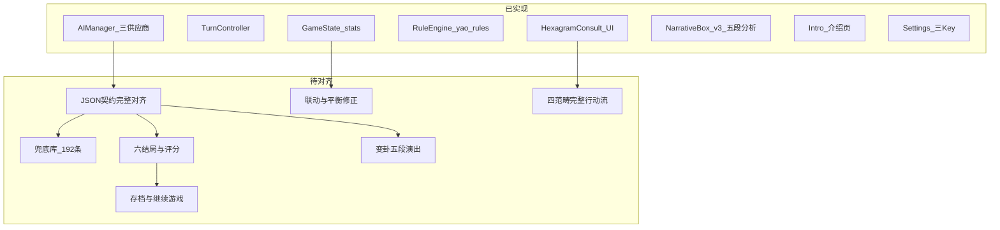

# 基于《项目文档》的后续开发任务规划

## 现状与文档差距（v1.2.4 更新）

### 已实现

- **多供应商 AI**：`AIManager.gd` 支持 DeepSeek（默认）/ Gemini / Claude 三分支，超时 30s，三 Key 独立存储于 `user://settings.cfg`。
- **JSON 契约扩展**：`analysis` 字段（五段式推演解析，各段【】标注）已加入 System Prompt、`AIResponseParser.normalize()`，及乾/坤/屯三卦兜底条目。
- **NarrativeBox v3**：双节点架构（`_story_label` 打字机 + `_analysis_box` 延迟显示），五色标头（绿/橙/红/蓝/紫）。
- **介绍页**：`Intro.tscn` + `Intro.gd` 已实现六节内容、固定底部按钮栏；主菜单路由已更新（新游戏→Intro，继续游戏→游戏本体）。
- **Settings 界面**：三供应商下拉菜单 + 三个 Key 输入框同步可见。
- **基础骨架**：回合闭环、动态 UI、`hexagrams.json` 扩充至 64 卦、`EndingRouter` 基础即时败局。

### 主要偏差（待修复）

| 编号 | 偏差项 | 涉及 PRD 节 |
|------|--------|------------|
| **P1** | `GameState` 初始三才为 50/50/50，文档 FR-01 要求 **60/55/50** | 4.2 |
| **P2** | 系统提示词未与 PRD 6.1 完整常量对齐（缺 `next_hexagram_hint` 说明、analysis 字段规范细化） | 6.1 |
| **P3** | 兜底叙事仅覆盖乾/坤/屯三卦（含 `analysis`），其余 61 卦 `analysis` 为空；MVP P0 要求至少 16 卦×4×3=192 条 | 6.4 / I-02 |
| **P4** | `ActionPanel` 未区分范畴（category）与具体行动（action_name），Payload 缺少精确传值 | 4.2 / 6.2 |
| **P5** | 开局未排除极端凶卦（第 29 坎、第 47 困等） | FR-01 |
| **P6** | `consult_failed` / `fallback_activated` 信号路径未统一走相同结算流 | 6.3 / A6 |
| **P7** | 数值联动硬编码缺失（民心<30 扣资财、资财<30 扣国力、危机 delta×1.5） | FR-06 / 9.3 |
| **P8** | `EndingRouter` 仅覆盖部分即时败局与"满回合即胜"，未实现 6 种结局与评分公式 | 第 10 节 |
| **P9** | FR-05 变卦五段演出（六爻高亮→变爻闪烁→新卦翻入→背景淡入→BGM 过渡）未按规格实现 | 4.2 |
| **P10** | Intro 页面无场景过渡动画（I-03） | FR-11 |
| **P11** | 存档系统（FR-09）未实现，主菜单"继续游戏"按钮无实际存档读取 | 4.4 |

---

## 阶段 A — P0：契约统一与核心规则（应最先做）

统一 **API / 兜底 / 解析** 三层使用同一套字段，消除字段名不一致隐患。

| 任务 | 说明 | 主要涉及文件 |
|------|------|----------------|
| ~~**A1. 校验并完整对齐响应 DTO**~~ ✅ **已完成** | `AIResponseParser.normalize()` 覆盖全部 PRD FR-08 字段（`narrative`/`yao_changed`/`delta_stats`/`philosophy`/`analysis`/`next_hexagram_hint`），含旧版别名兼容、clamp -20~+20、越界随机爻、`analysis` 为空时 NarrativeBox 不显示分析区。`HexagramConsult._on_ai_completed` 已移除冗余的二次 `normalize()` 调用，直接消费 AIManager 已规范化的字典。 | [AIResponseParser.gd](d:/AI互动叙事游戏/game/systems/AIResponseParser.gd)、[HexagramConsult.gd](d:/AI互动叙事游戏/game/scenes/HexagramConsult.gd) |
| ~~**A2. 系统提示词完整对齐**~~ ✅ **已完成** | `SYSTEM_PROMPT` 补充 `【输入格式】` 节（PRD 6.1 原缺失）；`analysis` 规格从"总量 200~350 字"更新为"每段 200~350 字，总五段不超过 1500 Token"（dev log v1.2.4 扩展规格）；新增输出规则 9 说明 `next_hexagram_hint`（15~30 字，可省略）。`_build_user_message` 新增 `_category_zh()` 辅助函数，user message 改为中文范畴名（攻击/防御/计谋/和谈）并加 `- ` 行前缀，与 PRD 6.1 输入格式严格一致。`MAX_TOKENS` 保留 1500（PRD 6.2 示例值 1000 基于旧版短 analysis，已被 dev log 覆盖）。 | [AIManager.gd](d:/AI互动叙事游戏/game/autoloads/AIManager.gd) |
| ⏸ **A3. 兜底数据结构扩容**（暂停，120/192 条） | **已完成卦 1–10**（batch1/batch2_fallback.py）：乾/坤/屯/蒙/需/讼/师/比/小畜/履，共 120 条，每条含五段 `analysis`，`yao_changed` 与 `yao_rules` 目标卦对应。**待续：卦 11–16**（泰/否/同人/大有/谦/豫）共 72 条，完成后达到 192 条 MVP 目标。 | [fallback_narratives.json](d:/AI互动叙事游戏/game/resources/fallback_narratives.json)、[tools/batch2_fallback.py](d:/AI互动叙事游戏/tools/batch2_fallback.py) |
| **A4. 开局与数值基准** | FR-01：`GameState.start_new_run()` 初始化三才为 **strength=60 / morale=55 / treasury=50**（当前为 50/50/50）；起卦伪随机排除极端凶卦（第 29 坎、第 47 困，可在 `GameState` 或 `RuleEngine` 中维护禁用列表）；开场叙事可先用静态模板占位。 | [GameState.gd](d:/AI互动叙事游戏/game/autoloads/GameState.gd) |
| **A5. 战略选择完整流程** | FR-03/FR-04：`ActionPanel` 须支持两级选择——先展示四范畴按钮，点击后展示该范畴 4~5 个具体行动（含 FR-04 完整选项表）；确认后向上传出 `{category, action_name}`；`build_payload` 与兜底选取均消费此二元组。 | [ActionPanel.gd](d:/AI互动叙事游戏/game/ui/ActionPanel.gd)、[HexagramConsult.gd](d:/AI互动叙事游戏/game/scenes/HexagramConsult.gd) |
| **A6. 错误与失败信号统一** | `consult_failed` / `fallback_activated` 触发后必须走与成功相同的「解析 → 叙事 → 变卦 → 结算」路径（当前存在短路风险）；错误日志含 HTTP 状态码与响应体（已部分实现，需验证完整性）。 | [HexagramConsult.gd](d:/AI互动叙事游戏/game/scenes/HexagramConsult.gd)、[AIManager.gd](d:/AI互动叙事游戏/game/autoloads/AIManager.gd) |
| **A7. 数值联动与保护** | FR-06、9.1、9.3：① 民心<30 → 资财每回合额外 -3；② 资财<30 → 国力每回合自动 -2；③ 危机状态（任一数值<30）时 delta 绝对值 ×1.5；④ 连续 3 次同爻强制换爻；⑤ 国力<25 时禁止国力继续下降超 10 点。集中在回合结算处处理，不依赖 AI 判断。 | [GameState.gd](d:/AI互动叙事游戏/game/autoloads/GameState.gd) 或独立结算函数 |

---

## 阶段 B — P0/P1：完整回合体验与 FR-05 演出

| 任务 | 说明 | 主要涉及 |
|------|------|----------|
| **B1. 变卦五段序列** | FR-05 严格按顺序：① 六爻依次高亮 0.8s → ② 变爻红色闪烁+音效 0.6s → ③ 新卦符号由下至上翻入 1.2s → ④ 背景插图淡入切换 0.6s → ⑤ BGM 平滑过渡 2.0s（并行）；动画进行中所有按钮不可点击；**快速模式**（设置项 `animation_speed=FAST`）总时长压缩 50%。 | [HexagramDisplay.gd](d:/AI互动叙事游戏/game/ui/HexagramDisplay.gd) 或新建 `HexagramTransition` 协调器节点 |
| **B2. HUD 与危机表现** | FR-02/8.3：回合计数（顶部 `当前/25`）、三才数值条 Tween 动画（0.5s，升绿降红闪烁）、任一数值<30 时对应数值条闪红且 HUD 边框变红、AI 等待时全屏半透明蒙层+毛笔书写"国师沉思中…"动画。 | `StatsHUD`、`HexagramConsult.gd` |
| **B3. 布局向 PRD 8.1 靠拢** | 1920×1080 基准分区：左侧卦象区（340px）/ 中间叙事+战略区（940px）/ 右侧三才 HUD（280px）/ 顶部栏（60px）；优先功能对齐，像素级还原留 M3。 | `HexagramConsult.gd` 布局代码 |

---

## 阶段 C — P1：六结局、评分、存档与设置完整化

| 任务 | 说明 | 主要涉及 |
|------|------|----------|
| **C1. 结局系统重写** | 按 PRD 第 10 节实现触发优先级：即时败局（国力<20 / 民心<15 / 资财<10）> 条件败局（第 21~25 回合国力单回合降幅>15）> 第 25 回合终局（偏安一隅 / 天下一统）；扩展 [EndingRouter.gd](d:/AI互动叙事游戏/game/systems/EndingRouter.gd) 与 [Ending.gd](d:/AI互动叙事游戏/game/scenes/Ending.gd) 展示不同文案。 | `EndingRouter`、`Ending` 场景 |
| **C2. 评分系统** | PRD 10.2 公式：`(strength+morale+treasury)×10 + (25-round)×50 + 卦象奖励 + 连贯性奖励`；S/A/B/C/D 评级；结局画面展示分数与评级。 | `Ending.gd` 或 `GameState` 快照 |
| **C3. 存档（FR-09）** | `user://save/autosave.json`（每回合结算后写入）+ `user://save/manual.json`（1 个手动槽）；字段含 version/saved_at/current_round/max_rounds/current_hexagram_id/stats/history（最多 10 条）/flags（tutorial_completed/first_crisis_triggered）；文件损坏时提示"存档异常，开始新游戏"不崩溃；主菜单"继续游戏"读取 autosave。 | 新建 `SaveManager` autoload；`MainMenu.gd` |
| **C4. 设置完整化（FR-10）** | 在现有三 Key + 供应商选择基础上补齐：动画速度（正常/快速枚举，驱动 B1 快速模式）、文字速度（滑块 1~5）、BGM 音量（0~100）、音效音量（0~100）、全屏开关；全部读写 `user://settings.cfg`；切换供应商时其他 Key 不丢失。 | [Settings.gd](d:/AI互动叙事游戏/game/scenes/Settings.gd)、各 UI 消费配置 |

---

## 阶段 D — P1 / M3：教程、内容资产与发布准备

| 任务 | 说明 |
|------|------|
| **D1. Intro 页过渡动画（I-03）** | 主菜单→Intro、Intro→游戏本体场景切换增加淡入淡出过渡，消除当前生硬直切（已知问题 I-03）。 |
| **D2. 情境式教程气泡（FR-12）** | 前 3 回合叠加提示气泡（回合 1 高亮战略区 / 回合 2 高亮卦象区 / 回合 3 高亮 HUD）；可点击关闭，本局不再显示；`flags.tutorial_completed` 写入存档。 |
| **D3. 兜底库扩全量** | 从 MVP P0 的 16 卦扩至 64 卦×4×3=768 条（含完整 `analysis` 字段）；可与美术并行推进。 |
| **D4. 美术与音频** | PRD 8.2：每卦水墨背景（512×512px）、BGM 映射、音效资源；`hexagrams.json` 中 `background_image` / `bgm_track` 字段与资源管线一致。 |
| **D5. 模块通信规范** | PRD 12.2：核心跨模块通信统一走 Godot Signals，逐步收敛直接跨场景节点引用；M3 进行代码审查消除技术债。 |
| **D6. 测试与指标** | 对照第 2、5 节：AI 成功率≥95%、P50 响应≤3s、P95≤6s、崩溃率≤1%；无 Key 兜底模式完整一局；存档读写≤100ms。 |

---

## 已知问题跟踪（来自 v1.2.4 开发日志）

| 编号 | 问题描述 | 优先级 | 对应任务 |
|------|---------|--------|--------|
| I-01 | Claude API 403 错误无友好 UI 提示（仅写日志） | 低 | C4（设置界面错误展示） |
| I-02 | 兜底叙事仅覆盖乾/坤/屯，其余 61 卦 `analysis` 为空 | 中 | **A3**（扩容至 16 卦 MVP 最低要求） |
| I-03 | Intro 页面无过渡动画，场景切换生硬 | 低 | **D1** |

---

## 建议执行顺序（摘要）

1. **A1–A3 + A6**：统一 JSON 契约与解析，修复兜底覆盖不足（I-02），否则结局、存档、统计均需返工。
2. **A4–A5 + A7**：初始数值修正（60/55/50）、完整战略行动流、数值联动规则对齐文档。
3. **B1–B3**：核心「爽点」演出（FR-05 五段变卦）与可读危机 HUD。
4. **C1–C4**：六结局+评分+存档，形成「能完整打完一局并有结果」的可玩 MVP。
5. **D1–D6**：Intro 过渡动画（I-03）、教程气泡、内容扩充、上架前 hardening。

> 每完成 A+B 或 C 阶段后，在 [项目文档.md](d:/AI互动叙事游戏/项目文档.md) 第 14 节顶部新增开发日志条目，并将版本号末位 +1（如 v1.2.4 → v1.2.5）。
