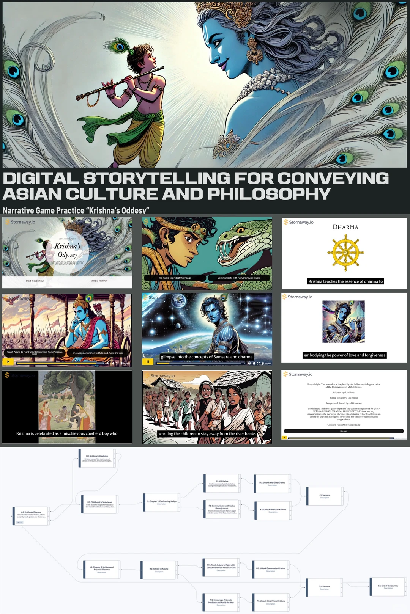

## 用AI做互动叙事游戏|印度神话改编
根据印度神话黑天（Krishna）的故事改编的，作为互动游戏初学者的小小尝试！
	
首先为了让神话故事更加有趣，我选取了三个黑天的主要故事情节：幼年在村庄生活，少年时与蛇怪Kaliya 的战斗，以及成年后协助朋友阿周那参加战争。
	
增加一些互动，设计了不同的选择，比如在面对蛇怪Kaliya 袭击村庄时，黑天选择用什么方法打败它，是用武力解决还是用爱感化，每种选择会让玩家解锁不同的印度哲学“法，梵，欲，利”。

- 在Miro 里先写好故事框架和各合卫桌选项后不同的剧情走向
- 根据脚木生成配图和对应的配音用runway
- 用Stornaway.io做成可以互动的游戏

## 1001 nights
🌀类型：人工智能 互动小说 视觉小说 打字 像素
🎮平台：Steam / itch.io均有试玩Demo
	
《1001 Nights》是款由大语言模型驱动的AI原生游戏。玩家扮演的山鲁佐德可以将语言转化为现实，因此你需要为国王编造一个精彩的故事，诱导他说出有关武器的话语，使其成为你手中的复仇的利刃。
	
🕊️试玩体验：Demo流程很短，AI的回应比预想中智能很多，无论是开头和妹妹的对话还是后面和暴君的对话，都不会有很僵硬的AI感，角色也不会因为玩家的引导出现ooc。女制作人的痕迹很明显，比如妹妹是个没驯化感的自然女宝。游玩体验最好的一点：AI是确确实实有根据你创造的故事作出回应，不是那种只讲被设定好内容的虚假AI游戏。除了角色的对话，AI也会根据玩家创造的故事生成不同的武器介绍文字和图像场景。比如咕的故事是月亮女神在沙漠中埋下宝藏，所以转场动画的背景就是巨大的月亮。steam介绍页也展示了其它主题，例如紫色森林、沙威玛大厨。当然游玩中也有一些小遗憾，比如要在国王耐心耗尽之前引导他说出各种武器，没法满嘴跑火车，武器的种类也有限。以及战斗部分过于简陋，没有什么复仇不检点暴君的爽感。

##

1 【*虽然是插画专业但是毕设做了游戏 - 橘子头springqccc | 小红书 - 你的生活兴趣社区】 😆 WovFWd9SQTEPFo3 😆 https://www.xiaohongshu.com/discovery/item/6933a256000000001e0268f8?source=webshare&xhsshare=pc_web&xsec_token=ABJid0POmcRTba8RtrxY82PsPmqmBWBIf17yIYC7qesa4=&xsec_source=pc_share